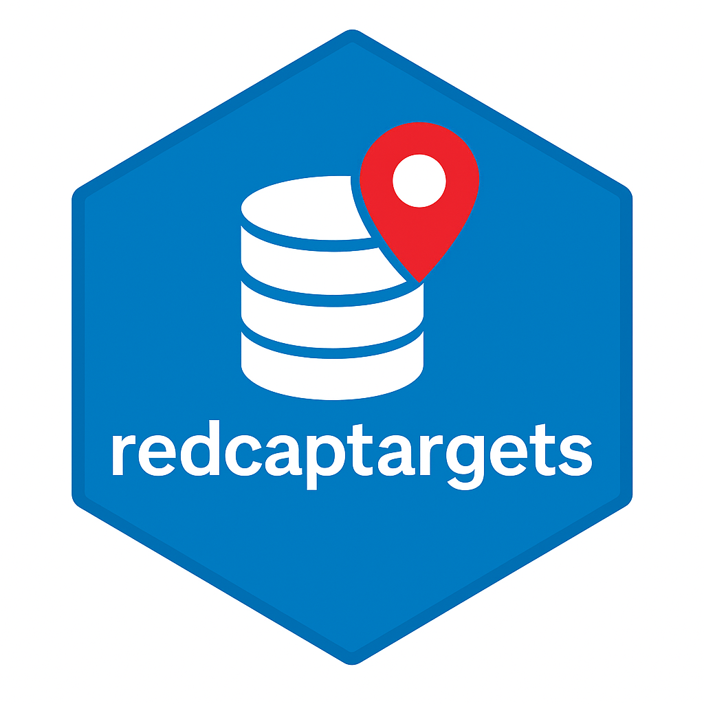

<!-- README.md is generated from README.Rmd. Please edit that file -->

```{r, include = FALSE}
knitr::opts_chunk$set(
  collapse = TRUE,
  comment = "#>",
  fig.path = "man/figures/README-",
  out.width = "100%"
)
```

# redcaptargets 

<!-- badges: start -->

[](https://github.com/overdodactyl/redcaptargets/actions/workflows/R-CMD-check.yaml)
<!-- badges: end -->

`redcaptargets` integrates [REDCap](https://project-redcap.org/) databases with the [`targets`](https://books.ropensci.org/targets/) pipeline toolkit to streamline reproducible clinical research workflows. It leverages the [`redcapAPI`](https://cran.r-project.org/web/packages/redcapAPI/index.html) package to connect to REDCap and automatically generates dynamic targets for both metadata and instrument-level data. By leveraging REDCap logging, redcaptargets detects meaningful changes and re-pulls data only when needed, minimizing compute time and ensuring local copies remain up to date. Modular factory functions minimize boilerplate and adapt seamlessly to evolving study designs.

## Motivation

REDCap doesn’t support SQL-like queries, so users often resort to pulling *all* data across all instruments into their workspace for analysis. This leads to slow, repetitive code, especially in longitudinal studies where:

-   New participants enroll continuously

-   Forms and surveys evolve

-   Analyses need frequent refreshes

`redcaptargets` simplifies this by integrating REDCap with the targets pipeline toolkit:

-   Automatically detects meaningful changes via REDCap logs

-   Dynamically creates targets for each instrument and metadata

-   Skips unnecessary pulls to save time and compute

-   Enables modular, reproducible workflows with built-in caching via gittargets

## Example

This example shows how to use `tar_redcap()`—the main function in `redcaptargets`—to pull all REDCap instruments and metadata into a targets pipeline.

#### **\_targets.R: Minimal example**

```{r echo_targets_script, results='asis', echo=FALSE}
targets_code <- readLines("_targets.R")
cat("```r\n")
cat(paste(targets_code, collapse = "\n"))
cat("\n```\n")
```

#### Trigger the pipeline

```{r echo=FALSE}
targets::tar_invalidate(everything())
```

```{r}
targets::tar_make()
```

#### View generated targets

Each instrument in the REDCap project will have its own target, along with one for metadata:

```{r}
manifest <- targets::tar_manifest()
manifest[c("name", "description")]
```
